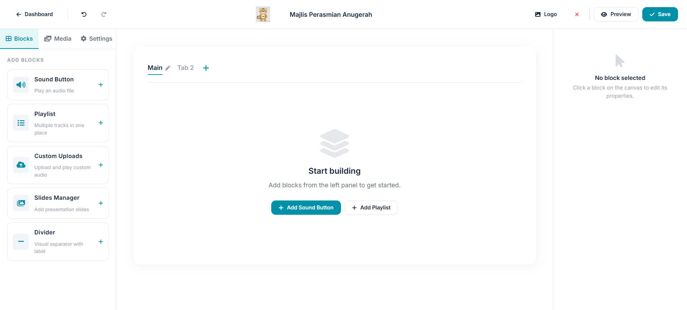
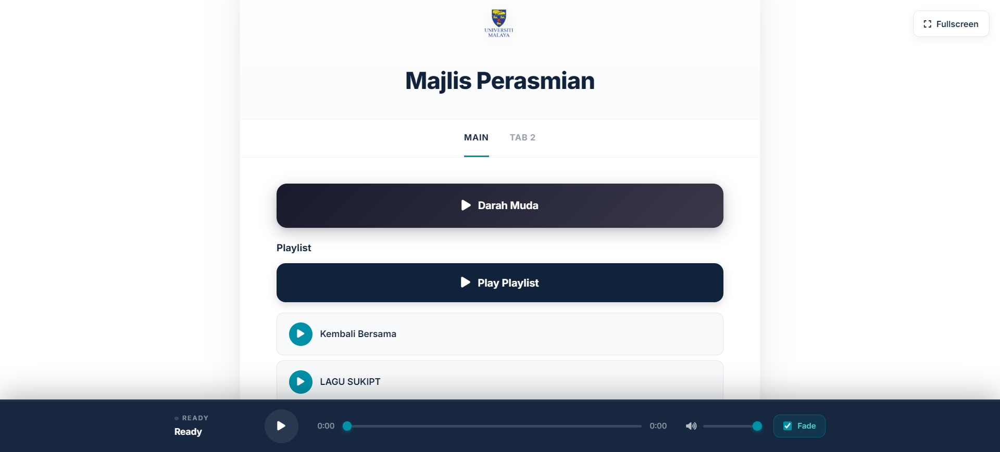
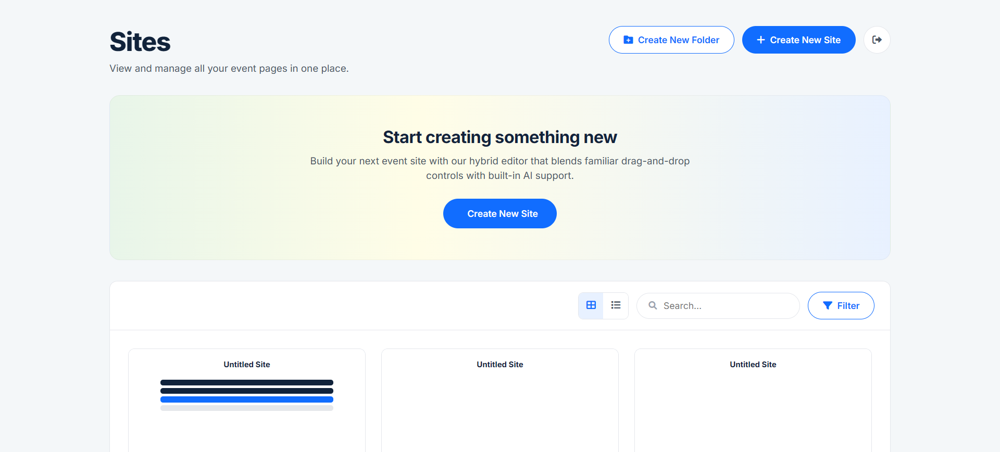

<div align="center">


# Podi@UM

**A cloud-based event presentation platform for universities**

Built for [SUKIPT 2026](https://sukipt.com.my) · Universiti Malaya

[](https://podium-builder.onrender.com)
[]()
[](LICENSE)
[]()
[]()
[]()

[Live Demo](https://podium-builder.onrender.com) · [Report Bug](https://github.com/q1ms/PodiUMbuilder/issues) · [Request Feature](https://github.com/q1ms/PodiUMbuilder/issues)

</div>

---

## 📸 Screenshots

<div align="center">

> 📷 Drop your screenshots into `docs/screenshots/` using the filenames below
> (`landing.png`, `builder.png`, `presenter.png`, `dashboard.png`) and they
> will appear here automatically.

### Landing Page


### Builder Interface


### Presenter View


### Dashboard


</div>

---

## ✨ Features

### 🎨 **No-Code Builder**
Drag-and-drop interface that lets organizers create professional event pages without writing a single line of code. Add sound buttons, playlists, slides, countdown timers, and dividers — all customizable.

### 📺 **Live Presenter View**
A dedicated public-facing presenter page that syncs with the builder in real-time via BroadcastChannel. Perfect for projector displays at ceremonies and events.

### 🎵 **Multi-Track Audio Engine**
Play audio with configurable fade in/out, crossfade between tracks, and seamless playlist auto-advance. Supports Cloudinary-hosted files or local uploads.

### 📊 **Medal & Awards System**
Generate dynamic podium displays for award ceremonies with support for gold, silver, bronze, and tie-breaking scenarios.

### 🔒 **Secure by Default**
- Supabase authentication (email + OAuth-ready)
- Row-level security on all user data
- JWT-based session management (tokens verified server-side via Supabase)
- Rate-limited API endpoints
- Helmet security headers
- Automated daily security audits via GitHub Actions

### ☁️ **Cloud-Native**
- Data stored in Supabase (PostgreSQL)
- Media hosted on Cloudinary CDN
- Deployed on Render with auto-deploy from GitHub
- Global CDN delivery for fast loading worldwide

### 📱 **Responsive Design**
Works beautifully on desktop, tablet, and mobile. Ideal for both event organizers at a laptop and attendees browsing from their phones.

---

## 🚀 Tech Stack

| Layer | Technology |
|-------|-----------|
| **Frontend** | Vanilla HTML, CSS, JavaScript (no build step), Lucide Icons |
| **Backend** | Node.js, Express |
| **Database** | Supabase (PostgreSQL) |
| **Auth** | Supabase Auth (JWT, RLS, OAuth) |
| **Media** | Cloudinary CDN |
| **Deployment** | Render (auto-deploy from GitHub) |
| **Monitoring** | Winston (logs), Sentry-ready |
| **Security** | Helmet, express-rate-limit, custom audit script |
| **CI/CD** | GitHub Actions (security audit + deploy) |

---

## 🏁 Getting Started

### Prerequisites

- **Node.js** v18 or higher
- **Supabase** account ([free tier](https://supabase.com))
- **Cloudinary** account ([free tier](https://cloudinary.com))
- **Render** account for deployment ([free tier](https://render.com))

### Local Development

```bash
# 1. Clone the repository
git clone https://github.com/q1ms/PodiUMbuilder.git
cd PodiUMbuilder

# 2. Install dependencies
npm install

# 3. Set up environment variables
cp .env.example .env
# Then edit .env with your credentials

# 4. Run the dev server
npm start

# 5. Open http://localhost:3000
```

### Environment Variables

Create a `.env` file with:

```env
# Supabase
SUPABASE_URL=https://your-project-id.supabase.co
SUPABASE_ANON_KEY=your_anon_key
SUPABASE_SERVICE_KEY=your_service_role_key

# Cloudinary
CLOUDINARY_CLOUD_NAME=your_cloud_name
CLOUDINARY_API_KEY=your_api_key
CLOUDINARY_API_SECRET=your_api_secret

# Optional
SENTRY_DSN=your_sentry_dsn
NODE_ENV=development
PORT=3000
```

> ⚠️ **Never commit your `.env` file.** It's already in `.gitignore`.
> The Supabase **anon key is public by design** — the browser SDK receives it
> from `/api/config`, and all data access is still enforced by row-level
> security. The **service role key must stay secret** (server-side only).

---

## 🗄️ Database Schema

### `sites` Table

```sql
create table sites (
  id uuid default gen_random_uuid() primary key,
  user_id uuid references auth.users(id) on delete cascade not null,
  name text not null default 'Untitled Site',
  data jsonb not null default '{}'::jsonb,
  created_at timestamptz default now() not null,
  updated_at timestamptz default now() not null
);
```

The `data` column stores the entire site state as JSON (components, tabs, media, colors, etc.).

### Row-Level Security

```sql
alter table sites enable row level security;

create policy "Users can view own sites"
  on sites for select using (auth.uid() = user_id);

create policy "Users can insert own sites"
  on sites for insert with check (auth.uid() = user_id);

create policy "Users can update own sites"
  on sites for update using (auth.uid() = user_id);

create policy "Users can delete own sites"
  on sites for delete using (auth.uid() = user_id);
```

---

## 📡 API Reference

| Method | Endpoint | Auth | Description |
|--------|----------|------|-------------|
| `POST` | `/api/signup` | ❌ | Create new account |
| `POST` | `/api/login` | ❌ | Authenticate user |
| `GET` | `/api/verify` | ✅ | Verify JWT token |
| `GET` | `/api/config` | ❌ | Public Supabase URL + anon key for the browser SDK |
| `GET` | `/api/me` | ✅ | Get current authenticated user |
| `GET` | `/api/sites` | ✅ | List user's sites |
| `POST` | `/api/sites` | ✅ | Create new site |
| `GET` | `/api/sites/:id` | ✅ | Get single site |
| `PUT` | `/api/sites/:id` | ✅ | Update site |
| `DELETE` | `/api/sites/:id` | ✅ | Delete site |
| `GET` | `/api/public/site/:id` | ❌ | Public read-only (for presenter/viewer) |
| `GET` | `/health` | ❌ | Health check endpoint |

---

## 🔒 Security

This project takes security seriously. Our automated audit runs daily and checks:

- ✅ HTTPS redirect
- ✅ Security headers (Helmet)
- ✅ Auth on all protected routes
- ✅ Rate limiting on login
- ✅ Row-level security enforcement
- ✅ No secrets in frontend
- ✅ XSS protection
- ✅ CORS configuration
- ✅ Error handling

Run the audit locally:

```bash
node security-audit.js
# or
npm run audit
```

---

## 🧪 Testing

```bash
# Run security audit against live URL (bash / macOS / Linux)
AUDIT_URL=https://podium-builder.onrender.com node security-audit.js

# Run against local dev (Windows PowerShell)
$env:AUDIT_URL='http://localhost:3000'; node security-audit.js
```

---

## 📦 Deployment

### Deploy to Render

1. Fork this repo
2. Create a new **Web Service** on [Render](https://render.com)
3. Connect your GitHub repository
4. Set:
   - **Build Command:** `npm install`
   - **Start Command:** `node server.js`
   - **Environment:** Node
5. Add all environment variables from `.env.example`
6. Click **Deploy**

Render will auto-deploy on every push to `main`.

---

## 🗺️ Roadmap

- [x] User authentication (email + password)
- [x] Drag-and-drop builder
- [x] Live presenter view
- [x] Multi-track audio with fade
- [x] Medal podium generator
- [x] Public shareable links
- [x] Automated security audits
- [ ] Google / Apple / Facebook OAuth
- [ ] Real-time multi-user editing
- [ ] Event templates marketplace
- [ ] Custom domain support per user
- [ ] Mobile PWA

---

## 🤝 Contributing

Contributions are welcome! Please read [CONTRIBUTING.md](CONTRIBUTING.md) for details on our code of conduct and the process for submitting pull requests.

---

## 📄 License

This project is licensed under the MIT License — see the [LICENSE](LICENSE) file for details.

---

## 👤 Author

**Your Name**

- GitHub: [@q1ms](https://github.com/q1ms)
- LinkedIn: [Your Name](https://linkedin.com/in/your-profile)
- Email: your@email.com

---

## 🙏 Acknowledgments

- Universiti Malaya for the opportunity to build this for SUKIPT 2026
- [Supabase](https://supabase.com) for the incredible auth + database platform
- [Cloudinary](https://cloudinary.com) for reliable media hosting
- [Render](https://render.com) for seamless deployment
- The open-source community for Node.js, Express, and vanilla JavaScript

---

<div align="center">

**Built with ❤️ at Universiti Malaya**

⭐ Star this repo if you find it useful!

</div>


